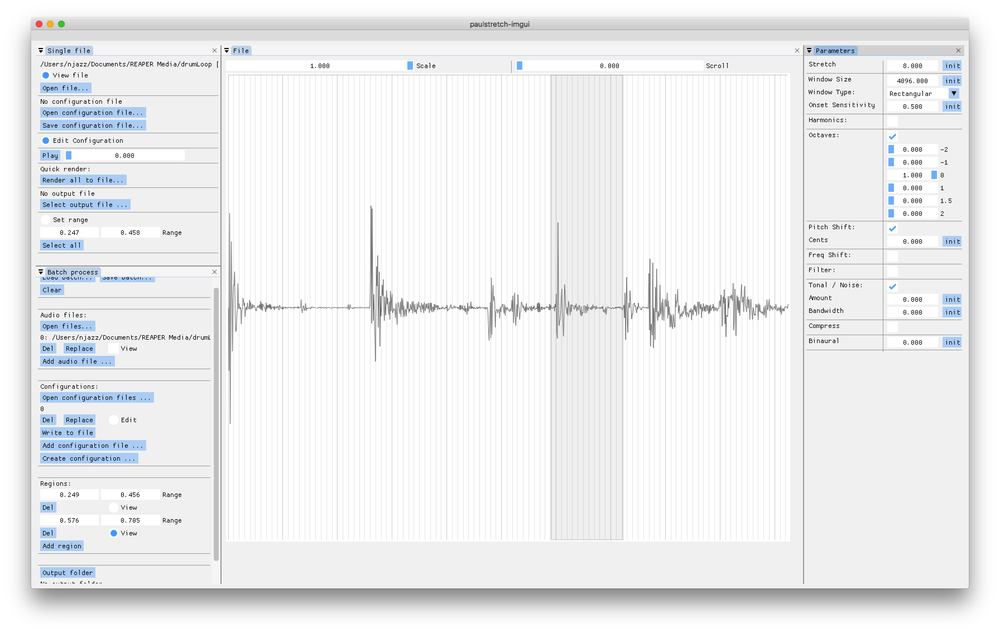

# C++ / python bindings for Paulstretch code by Nasca Octavian Paul

Contents: 
- "paulstretchlib" in lib/ — original code of the app wrapped as C++ library 
- "paulstretchpy" in py/ — python bindings for the library
- c++/imgui app in app-cxx/ 
- python/imgui app in app-py/ 

 

Library & app extra features: 
- multi-threaded batch processing
- JSON file formats for configuration and batch settings

Unsupported original features: 
- stretch rate limited to 10000x 
- parameter automation not yet implemented 
- original XML file support dropped 

Roadmap: 
- rewrite original code with less dependencies 
- automation for all parameters 
- automation editor in app 

Currently available builds: 
- windows (minGW) - FAILS 
- linux - not tested 
- macOS - OK 

build:  
git submodule init 
git submodule update 
cd lib && mkdir build 
cmake .. 
make 
cd ../../app-cxx 
mkdir build 
cd build 
cmake .. 
make
